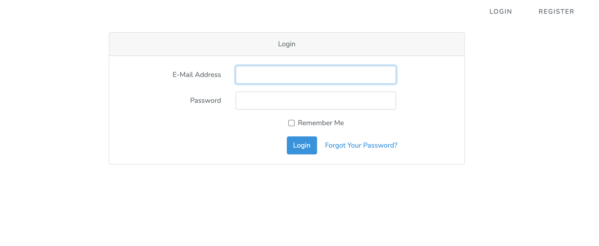
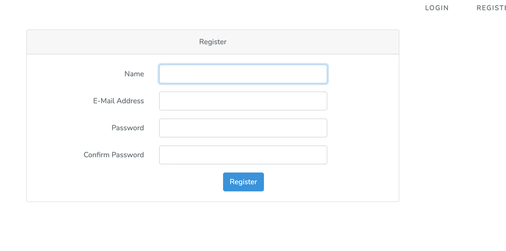
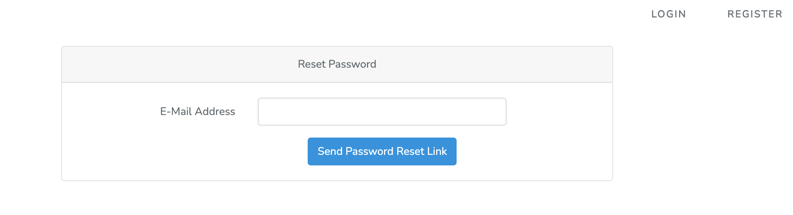
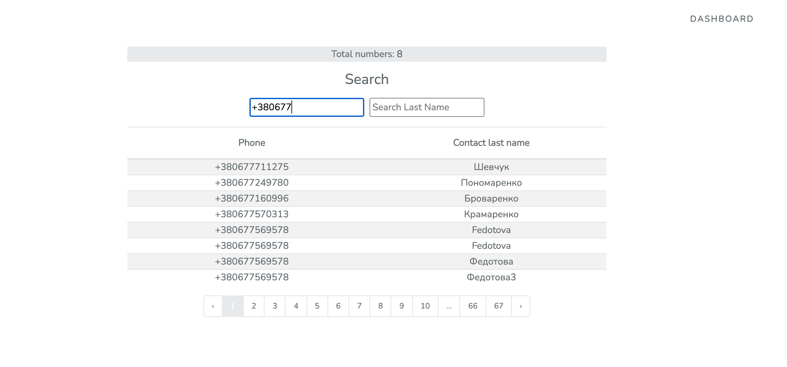
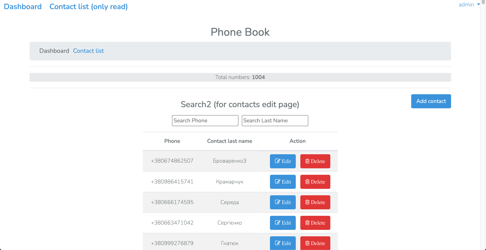
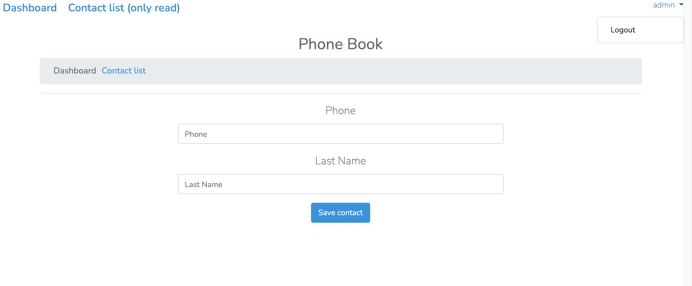
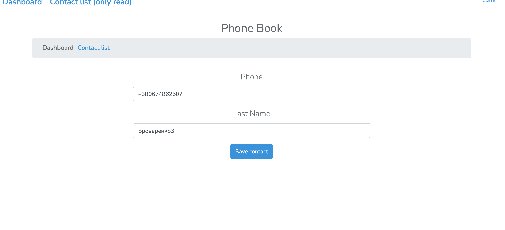

## Задача
Сделать RESTful API телефонного справочника.

Описание:
API должно содержать методы для совершения всех CRUD операций, необходимых, чтобы обеспечить функциональность самого просто телефонного справочника.
Страницу для вывода информации из справочника (в самом простом виде).
Возможность фильтрации по имени и номеру телефона.

## Использованы
- Laravel Framework 7.30.4
- jQuery 3.6.0 (подключена ради AJAX)

## Реализовано
1. Две страницы: корневая предназначена для просмотра контактов и доступна всем, а **/admin/phone** предназначена для редактирования списка и доступна только зарегистрированным пользователям.
2. Сделан AJAX поиск по контактам без перезагрузки страницы. Джава-скрипт перехватывает событие onkeyup и вызывает **SearchController**, который и ищет подходящие контакты.
3. Счётчик контактов. Обновляется при поиске.
5. Все тексты вынесены в языковые файлы.

##Установка
1. `git clone https://github.com/nadyafedotova/phonebook_laravel.git`
2. создание .env copy .env.example
3. создание базы данных `phonebook`
4. `php artisan key:generate`
5. запуск миграции и засеивание сидами `php artisan migrate:fresh --seed` 

## Скриншоты

